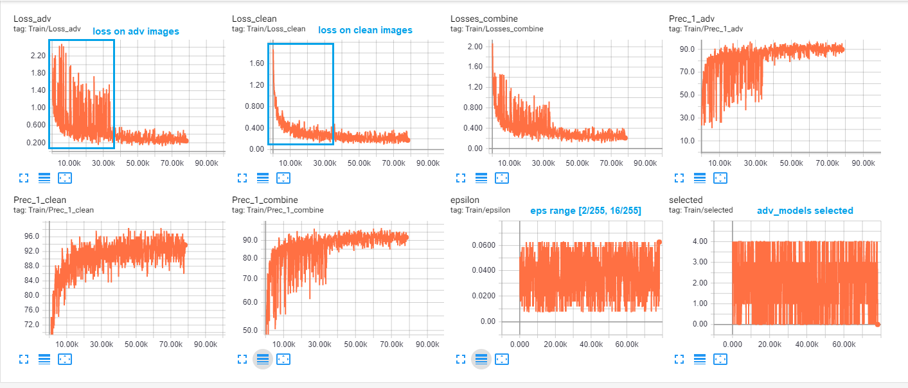

# Ensemble Adversarial Training


This repository contains code for performing ensemble adversarial training in Pytorch.


## Reference

The code takes followings as reference and has some little modifications:

* Florian, Tramèr, et al. "[Ensemble Adversarial Training: Attacks and Defenses](https://arxiv.org/abs/1705.07204)" arXiv preprint arXiv:1705.07204 (2018).
* Alexey, Kurakin, et al. "[Adversarial Machine Learning at Scale](https://arxiv.org/abs/1611.01236)" arXiv preprint arXiv:1611.01236 (2017).
* [ftramer/ensemble-adv-training](https://github.com/ftramer/ensemble-adv-training)


<br>

## REQUIREMENTS

The code was tested with Python 3.6, Pytorch 1.0.1.
tensorboardX
scipy


<br>


## Getting started
1. Prepare your pre-trained-static models (`Defense/models/` and `Defense/checkpoints/` )and modify the variable and directory to them accordingly in main file.

```python
# adv models: the static model used to generate adv input images
adv_resnet18 = ResNet18()
adv_resnet50 = ResNet50()
adv_mobilenet_125 = MobileNetV2(width_mult=1.25)
adv_googlenet = GoogLeNet()

adv_models = [adv_resnet18, adv_resnet50, adv_mobilenet_125, adv_googlenet]
adv_model_names = ['resnet18', 'resnet50', 'mobilenet_125', 'googlenet']

```


2. Setting the models to be trained and output and log directories.

```python
# models: models for be adv training
model_classes = [ ResNet34, ResNet101, MobileNetV2, MobileNetV2]
model_names = [ 'resnet34', 'resnet101', 'mobilenet_1', 'mobilenet_075']
params = {
    'mobilenet_1': 1.0,
    'mobilenet_075': 0.75,
}

adv_checkpoint_root_path = 'checkpoints/cifar10/'
output_path = 'checkpoints/adv_train/cifar10/' + trial_name +'/'
tensorboard_path = 'tensorboard/cifar10/adv_train/' + trial_name +'/'
```

3. Setting options for training schema, refered from [arXiv:1611.01236](https://arxiv.org/abs/1611.01236) and [arXiv:1705.07204](https://arxiv.org/abs/1705.07204) :
* option1 : distribution for random epsilon
```
arg.eps range (0,1) : fixed epsilon
arg.eps = 1 		: [arXiv:1611.01236](https://arxiv.org/abs/1611.01236), favor small epsilon
arg.eps = 2 		: uniform distribution, even the possibility for large and small eps
```
* option2: attacking method
```
arg.attacker = 'stepll'	: Step.L.L adv input, [arXiv:1705.07204](https://arxiv.org/abs/1705.07204)
arg.attacker = 'fgsm'	: fgsm adv input 
 ``` 
* option3: loss 
```
arg.loss_schema = 'averaged': no bias loss 
arg.loss_schema = 'weighted': [arXiv:1611.01236](https://arxiv.org/abs/1611.01236), loss favor for clean input
```

<br>


## Simple Example

| Accuracy     | sources              | holdout_sources          |
|--------------|----------|-----------|-----------------|--------|
| Target       | resnet18 | googlenet | resnet101       | vgg_11 |
|--------------|----------|-----------|-----------------|--------|
| ResNet34     | 17.44    | 18.36     | 18.09           | 18.13  |
| ResNet34_adv | 63.50    | 66.25     | 64.89           | 63.77  |
* (adv training on 200 epochs, more epochs would lead to higher Acc)

```bash
CUDA_VISIBLE_DEVICES=2,3 python3 main_ens_adv_train_cifar10.py --eps 2 --attacker 'stepll' --loss_schema 'averaged' --dataset 'cifar10'
```
* a resnet34 model adv training on CIFAR10, 
	adv_generators: [resnet18, resnet50, googlenet, mobilenet]
	holdout models: [resnet101]

* we can see from the following figure that as training the **loss decrease** (for both clean and adv images). 

* Specially there is violent oscillation in the adv_loss in the first half of the training procedure, which is due to we randomize the magnitude of epsilon at each batch. when epsilon is change from small to a large value, loss jump drastically, which match our expectation that **it is hard to learn from adv input**.

* The oscillation of adv_loss is damped after **30k iter**, showing that as the adv training going on, the adv_loss decrease and converge and the top1 accuracy on adv image increase to around the same level as clean images, regardless the magnitude of epsilon and the randomness of the adv_models, which showing model start to learning from perturbated input.

<p align="center">

</p>

<br>


## note
Make sure you have enough GPU memory to load all the pre-trained-static models. 
<br>
<br>
Compared with the refered [tensorflow 1.0 version](https://github.com/ftramer/ensemble-adv-training), which need to feed input images to all candidate adv generators when generating adv inputs, since the **static computational graph in TF 1.0**. <br>
This code just need to feed one adv_model (the currently selected one) for adv input generating, enjoying the advantage of **dynamic computational graph** in Pytorch, which (MAYBE) reduce the training time and allow to have more candidate-adv-generators.
